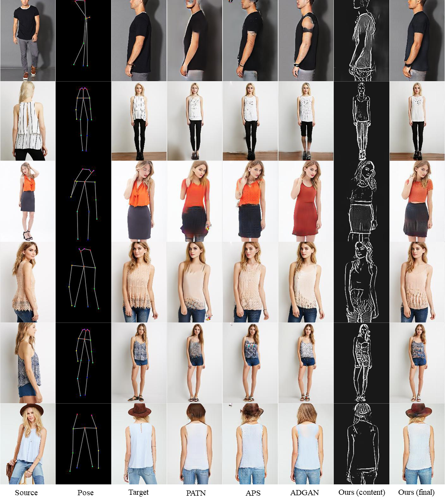

# Spatial Content Alignment GAN (SCA-GAN)

Official implementation of the paper [*"Spatial Content Alignment For Pose Transfer"*](https://arxiv.org/pdf/2103.16828.pdf), **ICME 2021(Oral)**  
Wing-Yin Yu, Lai-Man Po, Yuzhi Zhao, Jingjing Xiong, Kin-Wai Lau.
Department of Electrical Engineering, City University of Hong Kong



## Abstract
>Due to unreliable geometric matching and content misalignment, most conventional pose transfer algorithms fail to generate fine-trained person images. In this paper, we propose a novel framework – Spatial Content Alignment GAN (SCA-GAN) which aims to enhance the content consistency of garment textures and the details of human characteristics. We first alleviate the spatial misalignment by transferring the edge content to the target pose in advance. Secondly, we introduce a new Content-Style DeBlk which can progressively synthesize photo-realistic person images based on the appearance features of the source image, the target pose heatmap and the prior transferred content in edge domain. We compare the proposed framework with several state-of-the-art methods to show its superiority in quantitative and qualitative analysis. Moreover, detailed ablation study results demonstrate the efficacy of our contributions. 

## Getting Started

### Our generated images
Our generated images on test set can be downloaded from [Google Drive](https://drive.google.com/file/d/1SCsHjtbB89VjPI_poZUx61_1LjjivQ4D/view?usp=sharing) or [OneDrive](https://1drv.ms/u/s!ArBOL_2N_3Cflh_M7QgV1PkKT7lH?e=2gff8U).

### Installation

- python 3.7
- pytorch 1.4

```
git clone https://github.com/rocketappslab/SCA-GAN.git
cd SCA-GAN
pip install -r requirements.txt
```
### Data Preparation

[comment]: <> (- Navigate to [DeepFashion: In-shop Clothes Retrieval]&#40;http://mmlab.ie.cuhk.edu.hk/projects/DeepFashion/InShopRetrieval.html&#41;)

[comment]: <> (- Download ```Img/Img_highres.zip```. You may need the password from from official dataset maintainer.)

[comment]: <> (- Extract the ```Img_highres.zip``` under the ```fashion_data``` folder)

[comment]: <> (- Split the raw images into the train split ```fashion_data/train``` and the test split ```fashion_data/test```. Resize the images. Launch)

[comment]: <> (```)

[comment]: <> (python tool/generate_fashion_datasets.py)

[comment]: <> (```)
- Download resized train/test images from [Google Drive](https://drive.google.com/drive/folders/1S9KKEwj31hVzKq_eYMN6Y-jS5ji5ZzuS?usp=sharing) or [OneDrive](https://1drv.ms/u/s!ArBOL_2N_3CflhCZJFM5l0Opuffp?e=6yfPER). Put these two folders under the ```fashion_data``` directory.
- Download train/test pairs and train/test key points annotations from [Google Drive](https://drive.google.com/drive/folders/1S9KKEwj31hVzKq_eYMN6Y-jS5ji5ZzuS?usp=sharing) or [OneDrive](https://1drv.ms/u/s!ArBOL_2N_3CflhCZJFM5l0Opuffp?e=6yfPER), including **fasion-resize-pairs-train.csv**, **fasion-resize-pairs-test.csv**, **fasion-resize-annotation-train.csv**, **fasion-resize-annotation-train.csv**. Put these four files under the ```fashion_data``` directory.
- Generate the pose heatmaps. Note, the space of generated heatmaps are extremely large (~160GB for DeepFashion). Launch
```bash
python tool/generate_pose_map_fashion.py
```
- (For training only) Download edge maps from [Google Drive](https://drive.google.com/drive/folders/1S9KKEwj31hVzKq_eYMN6Y-jS5ji5ZzuS?usp=sharing) or [OneDrive](https://1drv.ms/u/s!ArBOL_2N_3CflhCZJFM5l0Opuffp?e=6yfPER). Put ```trainE``` under the ```fashion_data``` directory. Or you can use the [XDoG method](https://github.com/CemalUnal/XDoG-Filter) to generate the edge maps by yourself. Other edge detection methods are not fully tested.  
- (For training only) Download ```vgg19-dcbb9e9d.pth``` and  ```vgg_conv.pth``` from [Google Drive](https://drive.google.com/drive/folders/1jyuLLM9RWY2DDRpG67N3zQVfQbGgR_1m?usp=sharing) or [OneDrive](https://1drv.ms/u/s!ArBOL_2N_3CflhNRZGNSUxhOv-Dq?e=rwJQ4t) for perceptual loss and context loss. Put ```trainE``` under the ```fashion_data``` directory.   

The dataset structure is recommended as:
```
+—fashion_data
|   +--train
|       +-- e.g. fashionMENDenimid0000008001_1front.jpg
|   +--test 
|       +-- e.g. fashionMENDenimid0000056501_1front.jpg
|   +--trainK
|       +-- e.g. fashionMENDenimid0000008001_1front.jpg.npy
|   +--testK
|       +-- e.g. fashionMENDenimid0000056501_1front.jpg.npy
|   +--trainE
|       +-- diff
|           +-- e.g. MENDenimid0000008001_1front.png
|   +—fashion-resize-pairs-train.csv
|   +—fashion-resize-pairs-test.csv
|   +—fashion-resize-annotation-pairs-train.csv
|   +—fashion-resize-annotation-pairs-test.csv
|   +—train.lst
|   +—test.lst
|   +—vgg19-dcbb9e9d.pth
|   +—vgg_conv.pth
...
```

## Training
**Phase 1 - Prior Content Transfer Network (PCT-Net)**
- (Option 1) Train a PCT-Net from scratch. Launch
```bash
sh scripts/train_pctnet.sh
```
- (Option 2) Download pretrained PCT-Net from [Google Drive](https://drive.google.com/file/d/1WmkO-GCPORE0HLDjrSM6xLLol1DiZHDr/view?usp=sharing) or [OneDrive](https://1drv.ms/u/s!ArBOL_2N_3CflhiGYaPI1Wpdtt4T?e=RoyJNf). Extract the folder under ```checkpoints```
The file structure is recommended as:
```
+—checkpoints
|   +—scagan_pctnet
|       +--latest_netG.pth
...
```
**Phase 2 - Image Synthesis Network (IS-Net)**
- Train a IS-Net from scratch. Launch
```bash
sh scripts/train_isnet.sh
```

## Testing
- (Option 1) Once you have finished the training of IS-Net, you can inference the model by launching
```bash
sh scripts/test_isnet.sh
```
The generated imaged are located in ```result``` folder. 
- (Option 2) Or you can download our pretrained model from [Google Drive](https://drive.google.com/file/d/1EMcyhu8WkN19skCak3XMsxYqfXfkQSaV/view?usp=sharing) or [OneDrive](https://1drv.ms/u/s!ArBOL_2N_3Cflhs2HLHvOn7KRTaT?e=GAQ3ab). Launch the command of optional 1.  

The file structure is recommended as:
```
+—checkpoints
|   +—scagan_isnet
|       +--latest_netG.pth
...
```

## Evaluation

We provide a script that can evaluate **IS, SSIM, FID and LPIPS** metrics.

For evaluation, **Tensorflow 1.4.1(python3)** is required. Launch  
**Note: You need to modify the path ```generated_images_dir = YourImagesPath```**
```bash
python tool/getMetrics_fashion.py
```


## Citation
If you use this code for your research, please cite our paper.
```
@article{yu2021spatial,
  title={Spatial Content Alignment For Pose Transfer},
  author={Yu, Wing-Yin and Po, Lai-Man and Zhao, Yuzhi and Xiong, Jingjing and Lau, Kin-Wai},
  journal={arXiv preprint arXiv:2103.16828},
  year={2021}
}
```

### Acknowledgments
Our code is based on [PATN](https://github.com/tengteng95/Pose-Transfer) and [ADGAN](https://github.com/menyifang/ADGAN), thanks for their great work.